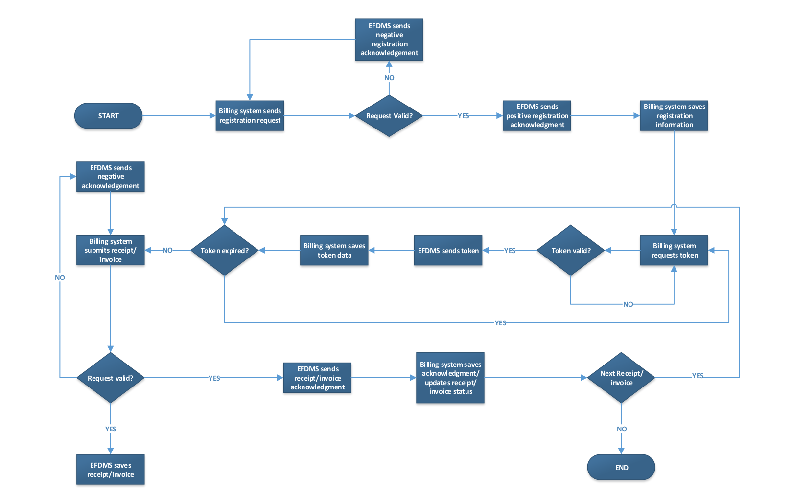

<p align="center">  </p>

<h1 align="center"> VIRTUAL FISCAL DEVICE (VFD) API</h1>

## API INTEGRATION DOCUMENT

- Endpoint for Registration (TEST SERVER) https://virtual.tra.go.tz/efdmsRctApi/api/vfdRegReq

- Endpoint for Token (TEST SERVER) https://virtual.tra.go.tz/efdmsRctApi/vfdtoken

- Endpoint for Receipt/Invoice posting (TEST SERVER) https://virtual.tra.go.tz/efdmsRctApi/api/efdmsRctInfo

- Endpoint for Z report posting (TEST SERVER) https://virtual.tra.go.tz/efdmsRctApi/api/efdmszreport

- Endpoint for verification of receipts/invoices (TEST SERVER) https://virtual.tra.go.tz/efdmsRctVerify/Home/Index

<!-- ## See abbreviations on page 30 -->

<br><br>

## EFDMS ENDPOINTS

1. Registration

It is a onetime request. Taxpayer must send TIN to TRA in order to generate VFD number.
Registration can be sent any time again in future in case VFD needs to retrieve original
registration data and server will resend the same information that were sent in first attempt.

2. Token

Token is a string of characters used as a second means of securing the API apart from
the PKI. After registering VFD must send request to get token data and use the token in
every request submitted. Token response will contain expiry time therefore billing VFD will
only request new token when existing one has expired.

3. Receipt/Invoice

Upon generation of receipt or invoice, VFD must submit respective receipt or invoice to
TRA. Before submitting information VD must check existing token if valid otherwise
request new token.

4. Z report

After close of business, VFD must submit Z report, which is a summary of sales for the
day. VFD should submit Z report before opening sales of a new day.

5. Verification

All receipts or invoices printed must be associated with verification information i.e. QR
code, verification code. VFD must be able to generate verification information

<br><br>

## INTEGRATION PARAMETERS

Client = webapi
Certkey – TRA will provide during integration
Cert-serial – Open certificate file and look for serial number
TIN- Taxpayer identification number for the seller
QR format: https://virtual.tra.go.tz/efdmsRctVerify/RCTVNUM
QR - Taxpayer system will generate QR and not TRA

<br><br><br>

## API INTEGRATION RULES

1. Registration is a onetime request. In order to be able to access `EFDMS` taxpayer (seller) must send TIN number so TRA can register VFD for use

2. Registration data must be saved to taxpayer system database for later use.

3. When successful registered VFD will not be required to send registration again when submitting receipts/invoices.

4. TIN belongs to the seller and not the customer (buyer). There is a parameter for customer i.e. `CUSTID`

5. Cert-Serial is a serial number of certificate file (pfx) used to sign request where private key will be used in this case. (TRA provides)

6. `GC, RCTNUM` and Dc must be maintained by taxpayer's system

7. GC must always be equal to `RCNUM` and starts from one (1) and always increment for each invoice/receipt issued. Numbers should follow sequence without skipping

8. DC starts with 1 and increment until 23:59:59 (midnight) and after midnight DC resets (starts with 1 again when first invoice/receipt for a new day is issued)

9. Different receipts/invoices can never have same GC they must always be unique

10. Different receipts/invoices can never have same `RCTNUM` they must always be unique

11. Different receipts/invoices issued in same day can never have same DC

12. `ZNUM` must always be same as `RCT_DATE` but in a number format i.e. YYYYMMDD

13. Previous receipt/invoice must never have latest `ZNUM`, `RCT_DATE` than the current receipt/invoice.

14. Future dates are not allowed, therefore when VFD generates receipt/invoice it must take current timestamp

15. If transaction is cancelled, next transaction should take not reuse transaction of cancelled transaction it should take new number in the sequence

16. Token will be requested only after expiry of current one, so before posting to TRA check if current token is valid and only post if is valid otherwise request new one

17. Token value must be saved to taxpayer system database

18. If for some reason if receipt is issued with wrong data but received success response, when sending again with correct data assign a new receipt number don’t reuse same if
    you send same receipt the later will be treated as duplicate and wont saved because `rctvnum` is same.

19. If `CUSTIDTYPE=1` i.e. TIN is chosen, we recommend to restrict input to only 9 digits meaning only numbers should be allowed because TIN is always a 9 digits number. `CUSTIDTYPES` for other IDs can remain open as string.

20. `MOBILENUM` should not contain `+` or spaces or dashes, it should in the format `255712XXXXXX` or `0712XXXXXX`

21. If VFD get success response it should not resubmit same transaction again.

22. If for any reason VFD does not receive response at all or receiving negative response (`ACKCODE` which is not 0) for specific invoice/receipt then when resubmitting the same invoice/receipt to TRA the VFD should submit the original xml content and not the modified the content this include also `ZNUM` and `RCT_DATE`, `RCT_TIME` must always be date of the first attempt and not the current date/time. This is to say monitor status of each receipt
    and only when response with `ACKCODE 0` returned consider receipt successful delivered to TRA

23. Print/send receipt/invoice to customer (do not wait for TRA response) and immediately send receipt to TRA (1 and 2 can either be concurrent or 2 can follow after 1)

24. For a specific receipt if no response is received VFD should keep try sending same request until it receives response.

25. Send one transaction at a time (asynchronous) only send next transaction when current one has succeeded

26. For printed receipts/invoices, taxpayer must display verification information (QR and code) on the printout.

27. To avoid receipt/invoices being rejected ,escape special characters in receipt/invoice XML especially in customer name or items descriptions.

28. When TRA server is not accessible (OFFLINE), continue generating transactions as they occur but make sure you design a mechanism to save status of each transaction i.e. success or pending while keep checking for connection and later when TRA connection resumes automatically resend all pending transactions in the order.

29. Token will be requested only after expiry of current one, so before posting to TRA check if current token is valid and only post if is valid otherwise request new one

30. Token value must be saved to taxpayer system database

## 1.1. Receipt/invoice format

Billing system shall `POST` to EFDMS data in `XML` format containing the following information

- 1.1.1. Date of receipt/invoice in the format “YYYY-MM-DD”
- 1.1.2. Time of receipt/invoice in the format HH:MM: SS
- 1.1.3. TIN of the business owner
- 1.1.4. Registration number of virtual device
- 1.1.5. Serial number of virtual device
- 1.1.6. Customer ID type
- 1.1.7. Customer ID
- 1.1.8. Customer name
- 1.1.9. Customer mobile number
- 1.1.10. Receipt/Invoice number
- 1.1.11. Daily counter of receipts/Invoice
- 1.1.12. Global counter of receipts/Invoice
- 1.1.13. Report number
- 1.1.14. Receipt/ invoice verification number
- 1.1.15. Item ID
- 1.1.16. Item description
- 1.1.17. Item quantity
- 1.1.18. Tax code
- 1.1.19. Item amount
- 1.1.20. Amount exclusive of tax
- 1.1.21. Amount inclusive of tax
- 1.1.22. Discount
- 1.1.23. Payment type
- 1.1.24. Payment amount
- 1.1.25. Tax rate group
- 1.1.26. Amount exclusive of tax
- 1.1.27. Tax
- 1.1.28. Signature (will not be printed on the invoice/receipt rather in XML)

## 1.2. Receipt/Invoice XML Data type

| Field      | Type      | Description                                                                                                                                                                                                                                                                                                                                    | Remark                                                                                                                                                                                                                                   |
| ---------- | --------- | ---------------------------------------------------------------------------------------------------------------------------------------------------------------------------------------------------------------------------------------------------------------------------------------------------------------------------------------------- | ---------------------------------------------------------------------------------------------------------------------------------------------------------------------------------------------------------------------------------------- |
| DATE       | Date      | Date of Issue                                                                                                                                                                                                                                                                                                                                  |
| TIME       | Time      | Time of the issue                                                                                                                                                                                                                                                                                                                              |
| TIN        | Number    | TAX identification number of the business owner                                                                                                                                                                                                                                                                                                |
| REGID      | String    | This is a unique ID issued to a virtual device (Taxpayer Billing System) upon a successful registration. User should not be able to program REGID, it should only be received from TRA server.                                                                                                                                                 | TRA will provide `REGID` during integration                                                                                                                                                                                              |
| EFDSERIAL  | String    | This is the serial number assigned to the virtual device (Taxpayer Billing System) also as known as CERTKEY. This number is composed of two digits that represent the manufacturer code followed by two letters representing the Tanzania country code and followed by the serial number of the production.                                    | Each virtual fiscal device should have a unique serial number to avoid matching with another virtual fiscal device(s). TRA will provide EFDSERIAL during integration. The format of the serial number should be like this: Example: 10TZ |
| CUSTIDTYPE | Number    | Buyer Used ID type. This can be one of the following 1=TIN 2=Driving License 3=Voters Number 4=Passport 5=NID (National Identity 6=NIL (If there is no ID)                                                                                                                                                                                     | This is mandatory.                                                                                                                                                                                                                       |
| CUSTID     | String    | Identification Number corresponding to the type chosen Mandatory if CUSTIDTYPE is not 6                                                                                                                                                                                                                                                        |
| CUSTNAME   | String    | Name of the Buyer. Option                                                                                                                                                                                                                                                                                                                      |
| MOBILENUM  | Number    | Buyer’s Mobile Number Option                                                                                                                                                                                                                                                                                                                   |
| RCTNUM     | Number    | This represent receipt/invoice number of each transaction that is unique for every transaction. RCTNUM starts with 1 and continue with sequence throughout. It will keep incrementing for every transaction. RCTNUM will be equal to GC where this is a global counter. i.e. 31, 32, 33.... 60 and this sequence should always increment by 1. |
| DC         | Number    | DC is the Daily Counter and is a sequence of receipts/ invoices issued for the day. DC will reset to 1 the following day up to the last receipt/ invoice issued                                                                                                                                                                                | For example, if until end of day, you have issued 30 receipts/invoice then we will have receipts/invoices no. 1, 2, 3.... 30. As for the following day, the DC counting will reset to 1,2,3,...                                          |
| GC         | Number    | GC is a global counter of the receipts/invoice issued from day one and shall keep incrementing throughout the life of the VFD                                                                                                                                                                                                                  | Example, if the last GC number for today after close of business is 1000 Then the value of GC when you open business next day will be 1001                                                                                               |
| ZNUM       | Number    | ZNUM for VFDs will be a number in format of (YYYYMMDD) e.g. 20190626 and this will change on Daily Basis i.e. ZNUM for Today: 20191018, ZNUM for yesterday: 20191017, ZNUM for tomorrow: 20191019. ZNUM is date of transaction written in number format.                                                                                       |
| RCTVNUM    | String    | A receipt/invoice verification number composes of RECEIPTCODE and GC i.e. GC appended to RECEIPTCODE. During registration, a VFD will be provided with RECEIPTCODE                                                                                                                                                                             | Example. Format description RECEIPTCODE: AAAA11, GC: RCTVNUM AAAA This filed is mandatory:                                                                                                                                               |
| ITEMS      | RecordSet | Contains ITEM                                                                                                                                                                                                                                                                                                                                  |                                                                                                                                                                                                                                          |
| ITEM       | RecordSet | RecordSet that contains details of the Item                                                                                                                                                                                                                                                                                                    |                                                                                                                                                                                                                                          |
| TOTALS     | RecordSet | Record that contains totals of the receipts/invoice                                                                                                                                                                                                                                                                                            |                                                                                                                                                                                                                                          |
| PAYMENTS   | RecordSet | RecordSet that contains payment                                                                                                                                                                                                                                                                                                                |                                                                                                                                                                                                                                          |
| VATTOTALS  | RecordSet | Nett and Tax Amounts Totals                                                                                                                                                                                                                                                                                                                    |                                                                                                                                                                                                                                          |

<br>

### ItemRecordSet

| Field   | Type   | Description                                                                                                                                      | Remark                                                                                          |
| ------- | ------ | ------------------------------------------------------------------------------------------------------------------------------------------------ | ----------------------------------------------------------------------------------------------- |
| ID      | String | Standard Item Code                                                                                                                               |
| DESC    | String | Name of items can either be standard or entered by user                                                                                          |
| QTY     | Number | Quantity                                                                                                                                         |
| TAXCODE | Number | Applicable tax on the item 1 = Standard Rate (18%)<br>2 = Special Rate (0%)<br>3 = Zero rated (0%)<br>4 = Special Relief (0%)<br>5 = Exempt (0%) | 1 for vatable<br>2 for spacial rate<br>3 for zero rated<br>4 for special relief<br>5 for exempt |
| AMT     | Double | Total Amount Inclusive of taxes                                                                                                                  |

<br>

### Receipt/invoice TotalsRecordSet

| Field        | Type   | Description                                                                       | Remark |
| ------------ | ------ | --------------------------------------------------------------------------------- | ------ |
| TOTALTAXEXCL | Double | Subtotal Totals Total amount of all the items exclusive of taxes                  |
| TOTALTAXINCL | Double | Grand Total Total amount of all the items inclusive of taxes                      |
| DISCOUNT     | Double | Total Discount Amount discounted from the total of all the items exclusive of tax |

<br>

### PaymentsRecordSet

| Field     | Type   | Description/Remark                                                                                                                                                         |
| --------- | ------ | -------------------------------------------------------------------------------------------------------------------------------------------------------------------------- |
| PMTTYPE   | String | Payment types <br>1. CASH<br>2. CHEQUE<br>3. CCARD<br>4. EMONEY<br>5. INVOICE. For RECEIPTS use payments types CASH, CHEQUE, CCARD or EMONEY For INVOICES use INVOICE only |
| PMTAMOUNT | Double | Payment amount based on payment type used VATTotalsRecordSet                                                                                                               |

<br>

| Field      | Type   | Description                                                                                                                                                                                        | Remark |
| ---------- | ------ | -------------------------------------------------------------------------------------------------------------------------------------------------------------------------------------------------- | ------ |
| VATRATE    | Char   | Identifier of the Tax rate<br>A= 18 (Standard Rate for VAT items)<br>B= 0 (Special Rate)<br>C= 0 (Zero rated for Non-VAT items)<br>D= 0 (Special Relief for relieved items)<br>E= 0 (Exempt items) |
| NETTAMOUNT | Double | Nett Sales                                                                                                                                                                                         |
| TAXAMOUNT  | Double | Tax Amount for the Rate                                                                                                                                                                            |
<br><br><br>

## 1.3. Message Flow

<!--  -->
<p align="center" > </p>

<br><br><br>

## 2.7.1 Registration

#### Message request header

A message request from taxpayer billing system to the EFDMS include the following information

| Parameter    | Value                                                                          |
| ------------ | ------------------------------------------------------------------------------ |
| Content-Type | `application/xml`                                                              |
| Cert-Serial  | Serial of the Key certificate to be provided by TRA. Should be base64 encoded. |
| Client       | webapi                                                                         |

<br>

#### Message request body

All message request from taxpayer billing systems to the EFDMS shall be enclosed in root (envelope) tag called <EFDMS>

| Tag                   | Description                                           |
| --------------------- | ----------------------------------------------------- | -------------- |
| `<EFDMS>`             | Root tag of the message request                       |
| `<REGDATA>`           | Tag that contains two tags <TIN> and <CERTKEY>        |
| `<TIN>`               | Taxpayer Identification Number of the business owner  |
| `<CERTKEY>`           | Vendor serial number which uniquely identify taxpayer | billing system |
| `<EFDMSSIGNATURE>`    | Using PKCS12 standard, signature obtained by Hashing  |
| `<REGDATA></REGDATA>` | using SHA 1 with RSA then result encoded to base64.   |

<br><br>

#### Example of registration request message

<!--  -->


<br><br>

#### Example of registration acknowledgment message

<!--  -->

<br><br>

### Data types for registration acknowledgement

| Field       | Data Type   | Mandatory | Description                                                                                                                     |
| ----------- | ----------- | --------- | ------------------------------------------------------------------------------------------------------------------------------- | ----------- | ------------------------------------------------------------------------ | --------- |
| EFDMSRESP   |             |           | Registration Information Envelop                                                                                                |
| ACKCODE     | Int(1)      | Yes       | 0 means success. Else it would be an error code                                                                                 |
| ACKMSG      | String (50) | Yes       | Describes the ACKCODE above                                                                                                     |
| REGID       | String (50) | Yes       | VFD System Registration Id                                                                                                      |
| SERIAL      | String (14) | Yes       | VFD System Serial Number also known as                                                                                          | CERTKEY or  | EFDSERIAL                                                                |
| UIN         | String      | Yes       | User identification number issued by TRA once Taxpayer has been registered in EFDMS                                             |
| TIN         | Number      | Yes       | Tax Identification Number of business owner                                                                                     |
| VRN         | String      | Yes       | Vat Registration Number                                                                                                         |
| MOBILE      | String      | Yes       | Mobile/Telephone number                                                                                                         |
| STREET      | String      | Yes       | Street                                                                                                                          |
| CITY        | String      | Yes       | City                                                                                                                            |
| ADDRESS     | String      | Yes       | Tax Payer’s Address                                                                                                             |
| COUNTRY     | String      | Yes       | Country                                                                                                                         |
| NAME        | String(100) | Yes       | Tax Payer Trading Name                                                                                                          |
| RECEIPTCODE | String      | Yes       | Also known as, RCTVCODE represents a unique                                                                                     | code        | issued during registration.                                              |
| REGION      | String      | Yes       | Tax Region                                                                                                                      |
| GC          | Number      | Yes       | GC is a global counter of the receipts/invoice                                                                                  | issued from | day one and shall keep incrementing. i.e. how many total receipts signed | till date |
| TAXOFFICE   | String      | Yes       | Tax Payer’s Tax Office                                                                                                          |
| USERNAME    | String      | Yes       | Username to be used for Token Request                                                                                           |
| PASSWORD    | String      | Yes       | Secret Key to be used for Token Request                                                                                         |
| TOKENPATH   | String      | Yes       | URL Path for Token Request                                                                                                      |
| TAXCODE     | Char        | Yes       | Applicable tax on the item <br>1=Standard(CODEA) <br>2=Special rate(CODEB) <br>3=Zero Rated (CODEC) <br>4=Special Relief(CODED) |

<br><br>

## 2.7.2. Token Request

EFDMS uses Tokens for message exchange between EFDMS and Tax Payer Billing System. All request that will be send to the server must be accompanied with valid token in the message header, which will be validated by the server and if the token is valid, then the billing system will able to access and post the transaction.

A token is a piece of data that has no meaning or use on its own, but combined with the correct tokenization system, becomes a vital player in securing the Web API. Token-based authentication works by ensuring that each request to the server is send together with a signed token, which the server verifies for authenticity and only then responds to the request. Token will be provide in seconds therefore taxpayer billing systems should be programmed in a way to only request new token when current one expires.

Token generated will have lifetime in seconds; the taxpayer billing system should always save token time and check the time now against the token time before posting the receipt/invoice. If the token time has expired, that is when taxpayer-billing system requests a new one. This mechanism helps taxpayer-billing systems to operate fast as opposed to requesting new token every time when posting receipt invoice since it involves adding claims to each token that would end up slowing the process.

<br>

### Token request body

Token request message shall include three parameters as shown in the following table

| Key        | Value                                                                                                                                  |
| ---------- | -------------------------------------------------------------------------------------------------------------------------------------- |
| Username   | Username of VFD. Username is found in the acknowledgment message sent to taxpayer billing system after successful registration request |
| Password   | Password of VFD. Password is found in the acknowledgment message sent to taxpayer billing system after successful registration request |
| grant_type | password                                                                                                                               |

<br><br>

> Note: Request form should x-www-form-urlencoded
> Example of token acknowledgment message

```json
{
  "access_token": "c3h4pIurCN85yOUJA1B--brtlnpvwAIVbNq-lD-wId3aUXHm2j6FweyZ0mLFitANgQ4vsotkdF7cR3F3GNdzwGPWUk28xACPLNPUnnsVPH9iWKaGiX_kpuKEhKLclRrcianjfg5BgpSAMg5tuughggghzwG9867WJlcox7QGv2RbZGoxzh8kW4QW6E278GFTa0V746tTZVs8lMGxLOjnoBA8jaBtZOig66pvHrdysajkl;lkjdhfjdsklkdsjgfhvjhskllkjfdjjsdjklaW5rVcjCFP8HlHJRfnWfb2LASB6ix605ezyrEnh-8bEoUWiJP4D_z82yvKyk4cnmIAN3vgaKWAg1fWW8pd_dNjhklLASKJDSSJ",
  "token_type": "bearer",
  "expires_in": 86399
}
```

### 2.7.3 Receipt/invoice Posting

#### Message request header

A message request from taxpayer billing system to the EFDMS include the following information

| Parameter     | Value                                                                                                           |
| ------------- | --------------------------------------------------------------------------------------------------------------- |
| Content-Type  | `application/xml`                                                                                               |
| Routing-Key   | `vfdrct`                                                                                                        |
| Cert-Serial   | Serial of the Key certificate provided. Should be base encoded.                                                 |
| Authorization | bearer token_value i.e. it should start with word bearer followed by space then followed by current token value |

### Message request body for receipt/invoice

Message acknowledgement for receipt/invoice

<!--  -->

#### Data type for receipt/invoice acknowledgment

| Field   | Data Type   | Mandatory? | Description                                           |
| ------- | ----------- | ---------- | ----------------------------------------------------- |
| RCTACK  |             |            | Receipt/invoice Acknowledgement Envelop               |
| RCTNUM  | Int         | Mandatory  | Receipt/invoice Number for the posted receipt/invoice |
| DATE    | DateAndTime | Mandatory  | Transaction Date YYYY-MM-DD                           |
| TIME    | DateAndTime | Mandatory  | Transaction Time HH24:MI:SS                           |
| ACKCODE | Int(1)      | Mandatory  | 0 means success. Else it would be an error code       |
| ACKMSG  | String(50)  | Mandatory  | Describes the ACKCODE above                           |

<br><br>

## 2.7.4. Z Report

#### Message request header

A message request from taxpayer billing system to the EFDMS include the following information

| Parameter     | Value/Description                                                |
| ------------- | ---------------------------------------------------------------- |
| Content-Type  | `application/xml`                                                |
| Routing-Key   | `vfdzreport^`                                                    |
| Cert-Serial   | Serial of the Key certificate provided. Should be base64 encoded |
| Authorization | bearer `^token_value^`                                           |

i.e. it should start with word bearer followed by space then followed by current token value

Message request body for Z report

### Data Type for Z report posting

| Field            | Data Type | Description Remarks                                                                                                                                                                                                                                                                                                                                                                                                      |
| ---------------- | --------- | ------------------------------------------------------------------------------------------------------------------------------------------------------------------------------------------------------------------------------------------------------------------------------------------------------------------------------------------------------------------------------------------------------------------------ | 
| DATE             | Date      | Date of the Z report                                                                                                                                                                                                                                                                                                                                                                                                     | 
| TIME             | Time      | Time of the issue (^)                                                                                                                                                                                                                                                                                                                                                                                                    | 
| HEADER           | Recordset | Contains Header lines LINE String Inside Header, define Name, Address, TIN, VRN, Telephone etc. as programmed in EFD and printed on each receipt Can be multiple, minimum 4 header lines and maximum 8 header lines                                                                                                                                                                                                      | 
| VRN              | String    | VAT registration number If taxpayer is registered on VAT, if not registered should show NOT REGISTERED                                                                                                                                                                                                                                                                                                                   |
| TIN              | String    | TAX identification number (^)                                                                                                                                                                                                                                                                                                                                                                                            |
| TAXOFFICE        | String    | Name of the Tax office where a taxpayer submits his/her returns                                                                                                                                                                                                                                                                                                                                                          |
| REGID            | String    | This is a unique ID issued to a fiscal device upon a successful registration. The `REGID` must not be programmed by user or technician and must only be received from server. REGID will be in format TZmmmnnnxxxxxxxxx Where mmm=manufacturer code nnn=supplier code xxxxxxxxx=unique ID issued for the device                                                                                                          |
| ZNUMBER          | Integer   | This is the serial number of the "Z" daily transaction report This is a progressive number that starts from 1 and always increment when Z is issued                                                                                                                                                                                                                                                                      |
| EFDSERIAL        | String    | This is the serial number of the fiscal device. This number is composed of two digits which represent the manufacturer code followed by two letters representing the Tanzania country code and followed by the serial number of the production. Each fiscal device should have a unique serial number to avoid matching with another fiscal device(s) The format of the serial number should be like this: Example: 01TZ |
| REGISTRATIONDATE | Date      | Date when the fiscal device has been registered/Fiscalized                                                                                                                                                                                                                                                                                                                                                               |
| USER             | String    | Identification number of the taxpayer                                                                                                                                                                                                                                                                                                                                                                                    |
| SIMIMSI          | String    | International Mobile Subscriber Identity (IMSI) for sim card used in the EFD Machine Fix value to WEBAPI TOTALS RecordSet Record that contains totals and each kind of counter since the last Z Report VATTOTALS RecordSet Nett and Tax Amounts Totals (^) PAYMENTS RecordSet RecordSet that contains payments                                                                                                           |
| CHANGES          | Recordset | This includes VAT rates, header changes and firmware changes Will further contain VATChanges, HeaderChanges or firmware changes ERRORS RecordSet Any Errors Contained Leave this node empty with both nodes                                                                                                                                                                                                              |
| FWVERSION        | String    | Firmware Version Fix value to 3.0                                                                                                                                                                                                                                                                                                                                                                                        |
| FWCHECKSUM       | String    | Firmware Checksum Fix value to WEBAPI                                                                                                                                                                                                                                                                                                                                                                                    |

### Z Report TotalsRecordSet

| Field             | Type    | Description/Remark                                  |
| ----------------- | ------- | --------------------------------------------------- |
| DAILYTOTALAMOUNT  | Double  | Total Sales Amount                                  |
| GROSSTOTAL        | Double  | Accumulative Total                                  |
| TOTALCORRECTION   | Double  | Any Corrections made (^)                            |
| TOTALDISCOUNTS    | Double  | Discounts for the Day (^)                           |
| TOTALSURCHARGE    | Double  | Extra Charges added                                 |
| TICKETSVOID       | Integer | Number of voided tickets                            |
| TOTALVOIDRECEIPTS | Double  | Amount of all voided receipts (^)                   |
| RECEIPTSFISCAL    | Integer | Number of fiscal receipts (^)                       |
| RECEIPTSNONFISCAL | Integer | Number of non fiscal receipts issued by the machine |

### VATTotalsRecordSet

| Field      | Type   | Description/Remark                   |
| ---------- | ------ | ------------------------------------ |
| VATRATE    | Char   | Identifier of the vatrate (A,B,C...) |
| NETTAMOUNT | Double | Nett Sales                           |
| TAXAMOUNT  | Double | Tax Amount for the Rate              |

### PaymentsRecordSet

| Field     | Type   | Description/Remark                                                       |
| --------- | ------ | ------------------------------------------------------------------------ |
| PMTTYPE   | String | Payment type can be <br>CASH <br>CHEQUE <br>CCARD <br>EMONEY <br>INVOICE |
| PMTAMOUNT | Double | Payment amount based on payment type used                                |

### ChangesRecordSet

| Field         | Type    | Description/Remark                                                                                                    |
| ------------- | ------- | --------------------------------------------------------------------------------------------------------------------- |
| VATCHANGENUM  | Integer | Number of changes on VAT rates If tax code value changes after sending registration request update vatchangenum count |
| HEADCHANGENUM | Integer | Number of changes on Header If header lines change after sending registration request update headchange count         |
| FMCHANGENUM   | Integer | Number of changes on firmware Fix value to zero                                                                       |

### VATChangesRecordSet

| Field     | Type   | Description/Remark                   |
| --------- | ------ | ------------------------------------ |
| VATRATE   | Char   | Identifier of the vatrate (A,B,C...) |
| FROMVALUE | Double | Previous value of the vat rate (^)   |
| TOVALUE   | Double | Current value of the vat rate        |

### HeaderChangesRecordSet

| Field      | Type    | Description/Remark                    |
| ---------- | ------- | ------------------------------------- |
| HEADERLINE | Integer | Number of header line starting from 1 |
| FROMVALUE  | String  | Previous text (^)                     |
| TOVALUE    | String  | Current text on the header line       |

### Data type for Z report acknowledgment

| Field   | Data Type   |           | Description                                     |
| ------- | ----------- | --------- | ----------------------------------------------- |
| ZACK    |             |           | Z-Report Acknowledgement Envelop                |
| ZNUMBER | Int         | Mandatory | Z-Report Number for the posted receipt          |
| DATE    | DateAndTime | Mandatory | Report Date YYYY-MM-DD                          |
| TIME    | DateAndTime | Mandatory | Report Time HH24:MI:SS                          |
| ACKCODE | Int(1)      | Mandatory | 0 means success. Else it would be an error code |
| ACKMSG  | String(50)  | Mandatory | Describes the ACKCODE above                     |

### Digital Signature Security

Signature generation:

1. Registration
   To get signature use private key provided to sign body section `<REGDATA></REGDATA>` using SHA1 algorithm with RSA

2. Receipt posting
   To get signature use private key provided to sign body section `<RCT></RCT>` using SHA1 algorithm with RSA

3. Z Report posting
   To get signature use private key provided to sign body section `<ZREPORT></ZREPORT>` using SHA 1 algorithm with RSA

### SAMPLE CODE FOR REFERENCE

Please refer this

```php
<!--
PHP EXAMPLE TO SEND SIGNED EFD MESSAGE REQUEST DATA TO TRA AND VERIFY SIGNED RESPONSE GENERATED BY TRA
Intended Users: TAX PAYERS
Prepared by: Richard Kazimoto
Date: 23 September, 2019.
-->
```

## Abbreviations

- EFDMS Electronic Fiscal Device Management System
- VFD Virtual Fiscal Device
- CLIENT Indicate mode of integration
- CERT-SERIAL Serial number of the issued certificate(hex) private key encoded to base 64
- CERTKEY Serial number of the virtual device issued to taxpayer
- REGDATA Tag containing registration request
- TIN Taxpayer Identification number
- EFDMSSIGNATURE Signature generated after signing registration or receipt/invoice content.
